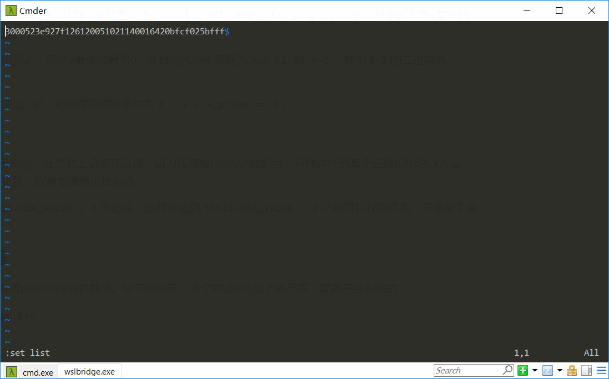
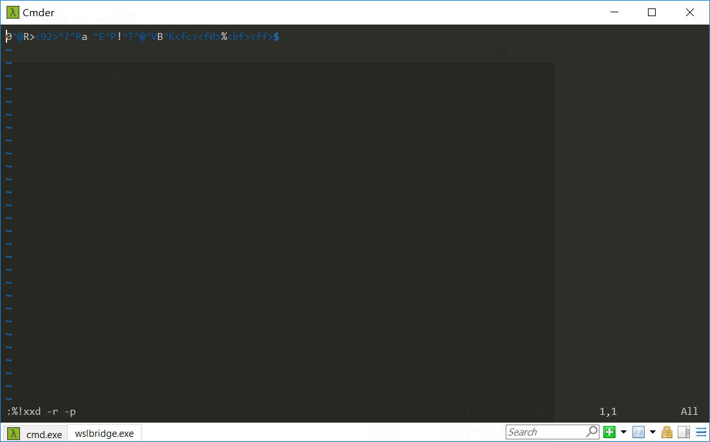

# LAB0-Report-Version2.0

- 姓名：魏剑宇
- 学号：PB17111586

---

## 最终代码

| machine          | assembly        |
| :--------------- | :-------------- |
| 0101001000111110 | AND R1, R0, #-2 |
| 1001001001111111 | NOT R1, R1      |
| 0001001001100001 | ADD R1, R1, #1  |
| 0010000000000101 | LD R0,x3009     |
| 0001000000100001 | ADD R0, R0, #1  |
| 0001000000100001 | ADD R2, R0, R0  |
| 0001011001000010 | ADD R3, R1, R2  |
| 0000101111111100 | BRnp #-4        |
| 1111000000100101 | TRAP HALT       |
| 1011111111111111 | .FILL xBFFF 	 |

## 实验过程

### 算法的思考过程

- 首先，考虑`SAR`的实现方法，有两个思路：
  1. 通过除法$\div 2$。

     1. 由于没有除法指令，通过二分法实现的复杂度为$O(\lg n)$=bits of n，效率与第二种相同，但实现起来较复杂，指令较多。

     2. 通过**穷举法**，从x=xBFFF开始，一直穷举，直到满足[条件](#迭代终止的条件)

  2. 通过位操作(在第一次提交中实现，11条指令，效率较高为$O(\lg  n)$=bits of n)
- **左移**：在穷举法中需要的左移，左移操作很好实现，只需将其$\times 2$，即加上它自己。

最终选择指令数较少的算法，穷举法，需要10条指令。

### 算法的大致思路

#### 迭代终止的条件

算术右移，即将一个数$\div 2$，并向$-\infin$取整，当$x >> 1 = y$时，有$x \div 2 = y$，$y + y = x'$，其中$x'$为离$x$最近的趋向于$- \infin$的偶数。

在汇编层级，为得到$x'$，可将$x$最低位置为0，在我的代码中表现为`AND R1 R0 #-2`，其中`#-2`的二进制为1111111111111110。

在实现中，先构造出$-x'$，则判定的结束条件为`2 * y + x_prime == 0`。

#### 迭代的起点

开始写此算法遇到Bug，在负数上会表现错误，因为我开始以0为迭代起点，这样迭代到某个正数相加时以为溢出，也能得到该负数。故需要谨慎选择起点。

这里我选择`int16.MIN_VALUE / 2`为起点，这样在达到`int16.MAX_VALUE / 2`之前可以找到答案，不会发生溢出。

### 如何写代码

首先，使用vim编辑plain hex的机器码。如下图所示（*为了防止vim加上换行符，需要开启-b模式*)

`vim -b program.bin`



在实验中，由于xxd没有`xxd -r -b`的用法，而我想直接写二进制不想转换为十六进制，所以使用了一个**丑陋**的方法。开启AutoHotKey，编写如下脚本。

```AutoHotKey
#Hotstring EndChars  //set trigger to space

:o:0000::0
:o:0001::1
:o:0010::2
:o:0011::3
:o:0100::4
:o:0101::5
:o:0110::6
:o:0111::7
:o:1000::8
:o:1001::9
:o:1010::A
:o:1011::B
:o:1100::C
:o:1101::D
:o:1110::E
:o:1111::F

```

这样，之后输入命令`%!xxd -r -p`即可。



### 测试

Simulator带有部分Debugger的功能。开始程序前修改R0的值，并与正确答案对照。测试用例的选取大致如下

- 首先，必须考虑正负两种情况下表现是否正确，即符号位为0/1的情况。
- 对符号位为0/1的情况随机取值，测试结果是否正确即可。
- 开始时对R7赋值，结束后观察R7是否改变。
- 例如0x7111（最高位为0），0x8001（最高位为1）。

同时需要考虑边界情况下表现是否正确，选取算例x0000,x0001,x1111,x7FFF,xFFFF.测试皆通过，基本可以认为此程序正确。
